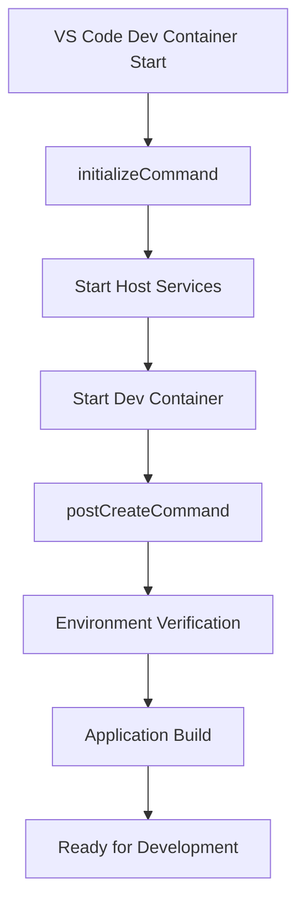

# Java 1.5 Dev Container Environment for Legacy Struts Applications

## ⚠️ IMPORTANT: Setup Required Before First Use

**Before starting the Dev Container, you must download and place the JDK binary file.**

👉 **See [docs/SETUP_REQUIRED.md](./docs/SETUP_REQUIRED.md) for detailed instructions**

**Quick Setup:**
1. Download `jdk-1_5_0_22-linux-amd64-rpm.bin` from [Oracle Java Archive](https://www.oracle.com/java/technologies/java-archive-javase5-downloads.html)
2. Place it in the `.devcontainer/` directory
3. Rebuild the Dev Container

---

## Description

This project provides a comprehensive VS Code Dev Container environment for developing legacy Java applications that require Java 1.5.0_22 (J2SE 5.0), specifically designed for Apache Struts applications. The environment includes a complete development stack with Java 5, application services (Tomcat, MySQL, phpMyAdmin), and modern development tools while maintaining compatibility with ancient Java versions.

## Dev Container Architecture

```
┌─────────────────────────────────────────────────────────────┐
│                    Dev Container Environment               │
├─────────────────────────────────────────────────────────────┤
│  🐳 compose.dev.yaml                                      │
│  ├─ Java 5 Development Container (java5-dev)              │
│  ├─ VS Code Extensions & Settings                         │
│  └─ Host Network Access                                   │
├─────────────────────────────────────────────────────────────┤
│  🔧 compose.services.yaml (Host-side Services)            │
│  ├─ Tomcat 5.5 (Port 8081)                               │
│  ├─ MySQL 5.7 (Port 3306)                                │
│  └─ phpMyAdmin (Port 8082)                                │
└─────────────────────────────────────────────────────────────┘
```

## Demo

### Quick Start with Dev Container

1. **Open in VS Code**: Open this project in VS Code
2. **Reopen in Container**: VS Code will prompt to reopen in Dev Container
3. **Automatic Setup**: Services start automatically via `initializeCommand`
4. **Development Ready**: Java 5 environment with all tools configured

```bash
# Verify environment after Dev Container starts
java -version
ant -version

# Build and deploy the Struts application
ant clean compile war

# Access services
# Tomcat: http://localhost:8081
# phpMyAdmin: http://localhost:8082
# Application: http://localhost:8081/legacy-app
```

### Manual Docker Commands (Alternative)

```bash
# Quick test - Check Java version
docker run --rm java5-tiger java -version

# Compile and run Java code
docker run --rm java5-tiger /bin/bash -c "
echo 'public class HelloWorld {
    public static void main(String[] args) {
        System.out.println(\"Hello, Java 1.5!\");
    }
}' > HelloWorld.java &&
javac HelloWorld.java &&
java HelloWorld"
```

## Features

### Dev Container Features
- **🏗️ Complete Development Environment**: VS Code Dev Container with full Java 5 support
- **🔄 Automatic Service Management**: Services start automatically when opening Dev Container
- **🌐 Host Network Integration**: Transparent access to application services
- **⚡ Hot Reload Development**: Fast edit-compile-test cycles
- **🔧 Pre-configured Tools**: All necessary extensions and settings included
- **📦 Dependency Management**: Automatic library and cache management

### Java & Runtime Features
- **Java 1.5.0_22 (J2SE 5.0)**: Complete JDK with Sun Microsystems 64-bit Server VM
- **Security Hardened**: Non-privileged user execution with proper file permissions
- **Pack200 Support**: Automatic extraction of compressed JAR files (rt.pack, jsse.pack, etc.)
- **Automated Installation**: License agreement automation with multiple fallback methods
- **Lightweight Base**: Debian bullseye-slim with minimal dependencies
- **Health Checks**: Built-in Java version validation
- **Timezone Support**: Configurable timezone (default: Asia/Tokyo)
- **Clean Environment**: Optimized image size with cleanup procedures

### Application Services
- **🌐 Tomcat 5.5**: Java 5 compatible application server (Port 8081)
- **🗄️ MySQL 5.7**: Legacy-compatible database server (Port 3306)
- **🔧 phpMyAdmin**: Web-based database administration (Port 8082)
- **📊 Service Monitoring**: Built-in service health checking scripts

## Requirements

### Dev Container Requirements
- **VS Code**: With Dev Containers extension installed
- **Docker**: Docker Desktop or Docker Engine
- **System Resources**:
  - Memory: 4GB+ recommended
  - Disk Space: 2GB+ for containers and volumes
  - Network: Internet access for initial setup

### Manual Docker Requirements (Alternative)
- Docker installed on your system
- JDK binary file: `jdk-1_5_0_22-linux-amd64-rpm.bin`
- Sufficient disk space (~501MB for final image)

## Usage

### Dev Container Usage (Recommended)

#### 1. Quick Start
```bash
# Clone the repository
git clone https://github.com/shinyay/docker-java5-for-legacy-app.git
cd docker-java5-for-legacy-app

# Open in VS Code
code .

# VS Code will prompt: "Reopen in Container" - Click it
# Services will start automatically
```

#### 2. Development Workflow
```bash
# Verify environment
java -version          # Should show Java 1.5.0_22
ant -version          # Should show Apache Ant

# Build the application
ant clean compile war

# Deploy to Tomcat (automatic via volume mount)
# WAR file is automatically available at dist/legacy-app.war

# Access services
curl http://localhost:8081/legacy-app/    # Your application
curl http://localhost:8082/               # phpMyAdmin
```

#### 3. Service Management
```bash
# Check service status
./.devcontainer/scripts/host-services.sh status

# Restart services if needed
./.devcontainer/scripts/host-services.sh restart

# Stop services
./.devcontainer/scripts/host-services.sh stop
```

### Manual Docker Usage (Alternative)

#### Basic Commands

```bash
# Build the Docker image
docker build -t java5-tiger .

# Run interactive shell
docker run -it --rm java5-tiger /bin/bash

# Mount application directory
docker run -it --rm -v $(pwd)/your-app:/app java5-tiger

# Background service
docker run -d --name struts-app -v /path/to/app:/app java5-tiger
```

### Development Environment

```bash
# Development with volume mount
docker run -it --rm \
  -v /path/to/your/struts-app:/app \
  -w /app \
  -p 8080:8080 \
  java5-tiger \
  /bin/bash
```

### Production Deployment

```bash
# Run as background service
docker run -d \
  --name struts-production \
  --restart unless-stopped \
  -v /path/to/app:/app \
  -p 8080:8080 \
  java5-tiger \
  java -jar your-application.jar
```

## Dev Container Configuration Details

### File Structure
```
.devcontainer/
├── devcontainer.json          # Main Dev Container configuration
├── compose.dev.yaml           # Development container definition
├── compose.services.yaml      # Application services definition
├── Dockerfile                 # Java 5 environment image
├── .gitignore                 # Git ignore patterns
├── README.md                  # This file
├── scripts/                   # Utility scripts
│   ├── host-services.sh       # Service management
│   ├── check-services.sh      # Health monitoring
│   ├── start-services.sh      # Automated startup
│   ├── build.sh              # Build automation
│   ├── dev-setup.sh          # Environment setup
│   ├── dev-server.sh         # Alternative development server
│   ├── check-setup.sh        # Pre-build validation
│   └── cleanup-old-containers.sh  # Container cleanup
└── docs/                      # Documentation
    ├── SETUP_REQUIRED.md      # Required setup instructions
    ├── CONTAINER_CLEANUP_FIX.md   # Container cleanup guide
    ├── CONTAINER_CONFLICT_FIX.md  # Conflict resolution guide
    └── DIAGNOSIS_AND_FIX.md   # Troubleshooting guide
```

### devcontainer.json Configuration

#### Core Settings
```json
{
    "name": "Java 5 Legacy Development Environment",
    "dockerComposeFile": "compose.dev.yaml",
    "service": "java5-dev",
    "workspaceFolder": "/app"
}
```

#### VS Code Extensions (Auto-installed)
| Extension | Purpose |
|-----------|---------|
| `redhat.java` | Java language support (Legacy Java 5 compatible) |
| `redhat.vscode-xml` | XML/JSP editing for Struts |
| `eamodio.gitlens` | Git integration and history |
| `gabrielgrinberg.ant-gradle-xml-formatter` | Ant build file support |
| `ithildir.java-properties` | Properties file editing |
| `ms-ceintl.vscode-language-pack-ja` | Japanese language pack |
| `vscode-icons-team.vscode-icons` | File type icons |

#### Java 5 Specific Settings
```json
{
    "java.jdt.ls.java.home": "/usr/java/jdk1.5.0_22",
    "java.configuration.runtimes": [
        {
            "name": "J2SE-1.5",
            "path": "/usr/java/jdk1.5.0_22",
            "default": true
        }
    ],
    "java.compile.nullAnalysis.mode": "disabled",
    "java.autobuild.enabled": false,
    "java.project.sourcePaths": ["src/main/java"],
    "java.project.outputPath": "build/classes",
    "java.project.referencedLibraries": [
        "lib/**/*.jar",
        "src/main/webapp/WEB-INF/lib/**/*.jar"
    ]
}
```

#### Lifecycle Commands
| Command | Timing | Purpose |
|---------|--------|---------|
| `initializeCommand` | Before container starts | Start host services |
| `postCreateCommand` | After container creation | Verify environment, build app |
| `updateContentCommand` | Container updates | Notify successful update |

### compose.dev.yaml - Development Container

#### Container Configuration
```yaml
services:
  java5-dev:
    build:
      context: .
      dockerfile: Dockerfile
    container_name: java5-legacy-dev
    network_mode: host              # Access host services transparently
    volumes:
      - ..:/app:cached              # Project files
      - ~/.gitconfig:/home/javauser/.gitconfig:ro  # Git config
      - maven-cache:/home/javauser/.m2             # Maven cache
      - ant-cache:/home/javauser/.ant              # Ant cache
    environment:
      - TZ=Asia/Tokyo
      - LANG=ja_JP.UTF-8
      - JAVA_OPTS=-Xdebug -Xrunjdwp:transport=dt_socket,server=y,suspend=n,address=9000
```

### compose.services.yaml - Application Services

#### Tomcat 5.5 Configuration
```yaml
tomcat:
  image: tomcat:5.5.36-jdk8
  container_name: legacy-tomcat
  ports: ["8081:8080"]
  volumes:
    - ../dist:/usr/local/tomcat/webapps         # WAR deployment
    - ../config:/usr/local/tomcat/conf/...      # Configuration
  environment:
    - CATALINA_OPTS=-Xms256m -Xmx512m
```

#### MySQL 5.7 Configuration
```yaml
mysql:
  image: mysql:5.7
  container_name: legacy-mysql
  ports: ["3306:3306"]
  environment:
    - MYSQL_ROOT_PASSWORD=root
    - MYSQL_DATABASE=legacy_db
    - MYSQL_USER=legacy_user
    - MYSQL_PASSWORD=legacy_pass
  volumes:
    - mysql_data:/var/lib/mysql                 # Data persistence
```

#### phpMyAdmin Configuration
```yaml
phpmyadmin:
  image: phpmyadmin/phpmyadmin:5.1
  container_name: legacy-phpmyadmin
  ports: ["8082:80"]
  environment:
    - PMA_HOST=mysql
  depends_on: [mysql]
```

### Development Workflow

#### Automatic Startup Sequence


#### Development Cycle
1. **Edit Code**: Use VS Code with full Java 5 support
2. **Build**: `ant clean compile war`
3. **Deploy**: WAR automatically deployed via volume mount
4. **Test**: Access at `http://localhost:8081/legacy-app`
5. **Debug**: Remote debugging available on port 9000

### Network Architecture

The Dev Container uses `network_mode: host` for transparent access to services:

```
┌─────────────────────────────────────────────┐
│               Host Network                  │
├─────────────────────────────────────────────┤
│  Dev Container (java5-dev)                 │
│  ├─ Port 9000: Java Debug                  │
│  └─ Direct access to host ports            │
├─────────────────────────────────────────────┤
│  Host Services                              │
│  ├─ Port 8081: Tomcat                      │
│  ├─ Port 3306: MySQL                       │
│  └─ Port 8082: phpMyAdmin                  │
└─────────────────────────────────────────────┘
```

## Installation

### 1. Dev Container Setup (Recommended)

#### Prerequisites
```bash
# Install VS Code
# Install Dev Containers extension
# Ensure Docker is running
```

#### Quick Setup
```bash
git clone https://github.com/shinyay/docker-java5-for-legacy-app.git
cd docker-java5-for-legacy-app
code .
# Click "Reopen in Container" when prompted
```

### 2. Manual Docker Setup (Alternative)

#### Obtain JDK Binary

Download the JDK 1.5.0_22 binary from Oracle's archive:
```
jdk-1_5_0_22-linux-amd64-rpm.bin
```

**Download Source**: [Oracle Java SE 5.0 Archive Downloads](https://www.oracle.com/java/technologies/java-archive-javase5-downloads.html)

Place this file in the `.devcontainer/` directory.

#### Build Image

```bash
# Standard build (from .devcontainer/ directory)
docker build -t java5-tiger .

# Build with custom timezone
docker build --build-arg TIMEZONE=America/New_York -t java5-tiger .
```

#### Verify Installation

```bash
# Test Java installation
docker run --rm java5-tiger java -version
docker run --rm java5-tiger javac -version

# Test compilation
docker run --rm java5-tiger /bin/bash -c "
echo 'public class Test { public static void main(String[] args) { System.out.println(\"Working!\"); } }' > Test.java &&
javac Test.java &&
java Test"
```

## Technical Details

### Dev Container Architecture
- **Primary Container**: Java 5 development environment
- **Service Management**: Host-side services with transparent access
- **Network Mode**: Host networking for simplified connectivity
- **Volume Strategy**: Bind mounts for code, volumes for caches
- **Security**: Non-privileged user execution

### Image Information
- **Base Image**: debian:bullseye-slim
- **Java Version**: 1.5.0_22 (J2SE 5.0)
- **User**: javauser (non-privileged)
- **Working Directory**: /app
- **JAVA_HOME**: /usr/java/jdk1.5.0_22
- **Image Size**: ~501MB

### Service Ports
| Service | Port | Purpose |
|---------|------|---------|
| Tomcat | 8081 | Application server |
| MySQL | 3306 | Database server |
| phpMyAdmin | 8082 | Database administration |
| Java Debug | 9000 | Remote debugging |

### Pack200 Extraction
The build automatically extracts compressed JAR files:
- rt.pack → rt.jar (Runtime classes)
- jsse.pack → jsse.jar (SSL/TLS support)
- charsets.pack → charsets.jar (Character encodings)
- localedata.pack → localedata.jar (Localization data)
- tools.pack → tools.jar (Development tools)

### Troubleshooting

#### Dev Container Issues

**"Failed to start Dev Container"**
- Ensure Docker is running and accessible
- Check if ports 8081, 8082, 3306 are available
- Try rebuilding: "Dev Containers: Rebuild Container"

**"Services not accessible"**
- Run: `./.devcontainer/scripts/host-services.sh status`
- Restart services: `./.devcontainer/scripts/host-services.sh restart`
- Check Docker containers: `docker ps`

**"Java extension not working"**
- Java 5 has limitations with modern language servers
- Some features may be disabled for compatibility
- Use manual compilation: `ant clean compile`

#### Legacy Java Issues

**"java/lang/NoClassDefFoundError: java/lang/Object"**
- This error occurs when pack200 files aren't extracted
- The Dockerfile automatically handles this issue

**License Agreement Issues**
- Build includes automated license acceptance
- Multiple fallback methods ensure reliable installation

**Permission Issues**
- Use `--user root` flag if root access is needed
- Default user is `javauser` for security

## Utility Scripts

The `.devcontainer/scripts/` directory contains helpful utilities for managing the development environment:

### Service Management Scripts

#### host-services.sh
Manages Docker Compose services (Tomcat, MySQL, phpMyAdmin) running on the host.

```bash
# Check service status
./scripts/host-services.sh status

# Start all services
./scripts/host-services.sh start

# Stop all services
./scripts/host-services.sh stop

# Restart services
./scripts/host-services.sh restart
```

**Purpose**: Primary service management interface for the host-side application services.

#### check-services.sh
Monitors and validates the health of running services with detailed port accessibility checks.

```bash
# Continuous service monitoring
./scripts/check-services.sh

# One-time status check
./scripts/check-services.sh --once
```

**Purpose**: Service health monitoring and troubleshooting.

#### start-services.sh
Automated startup script that builds the application and starts all required services.

```bash
./scripts/start-services.sh
```

**Purpose**: One-command startup for complete environment initialization.

### Build and Development Scripts

#### build.sh
Comprehensive build automation script for Java 5 legacy applications with support for multiple build targets.

```bash
# Full build (default)
./scripts/build.sh build

# Clean build artifacts
./scripts/build.sh clean

# Compile only
./scripts/build.sh compile

# Create WAR file
./scripts/build.sh war

# Generate JavaDoc
./scripts/build.sh javadoc

# Show help
./scripts/build.sh help
```

**Purpose**: Flexible build automation with environment validation and directory management.

#### dev-setup.sh
Interactive development environment setup script that creates project structure, configuration files, and sample code.

```bash
# Complete setup (default)
./scripts/dev-setup.sh all

# Show environment info
./scripts/dev-setup.sh env

# Initialize directory structure
./scripts/dev-setup.sh init

# Create configuration files
./scripts/dev-setup.sh config

# Create sample Struts application code
./scripts/dev-setup.sh sample

# Show help
./scripts/dev-setup.sh help
```

**Purpose**: Project scaffolding and sample code generation for Struts applications.

#### dev-server.sh
Alternative development server using Jetty 6.1 for testing WAR files when external Tomcat is unavailable.

```bash
./scripts/dev-server.sh
```

**Purpose**: Fallback application server for development and testing.

### Maintenance Scripts

#### check-setup.sh
Validates that the required JDK binary file exists before Dev Container build.

```bash
./scripts/check-setup.sh
```

**Purpose**: Pre-build validation to ensure all required files are in place. This script checks for `jdk-1_5_0_22-linux-amd64-rpm.bin` and provides detailed setup instructions if missing.

#### cleanup-old-containers.sh
Cleanup script to remove old/orphaned containers before starting the dev environment.

```bash
./scripts/cleanup-old-containers.sh
```

**Purpose**: Prevents port conflicts and ensures clean startup by removing stale containers.

## Documentation

The `.devcontainer/docs/` directory contains detailed documentation for troubleshooting and setup:

### SETUP_REQUIRED.md
**Critical setup instructions** for obtaining and placing the JDK 1.5.0_22 binary file required for building the Dev Container.

**Contents**:
- JDK binary download instructions
- Oracle Java Archive access guide
- File placement and verification steps
- License agreement information

**When to use**: Before starting the Dev Container for the first time.

### CONTAINER_CLEANUP_FIX.md
Documentation for resolving container conflicts and port binding issues.

**Contents**:
- Common container conflict scenarios
- Port conflict resolution
- Cleanup procedures for orphaned containers
- Best practices for container management

**When to use**: When experiencing container startup failures or port conflicts.

### CONTAINER_CONFLICT_FIX.md
Detailed guide for resolving Docker container naming conflicts and service collision issues.

**Contents**:
- Container naming conflict resolution
- Service name collision fixes
- Docker Compose troubleshooting
- Network configuration issues

**When to use**: When containers fail to start due to naming conflicts.

### DIAGNOSIS_AND_FIX.md
Comprehensive troubleshooting guide for Dev Container environment issues.

**Contents**:
- Common error patterns and solutions
- Service connectivity problems
- Build failures and dependency issues
- Environment configuration problems
- Step-by-step diagnostic procedures

**When to use**: When experiencing any Dev Container or service-related issues.

## Development Best Practices

### Project Structure
```
/app/
├── src/main/java/          # Java source code
├── src/main/webapp/        # Web application files
├── src/main/resources/     # Resource files
├── lib/                    # External JAR dependencies
├── build/                  # Compiled classes (auto-generated)
├── dist/                   # WAR files (auto-generated)
├── config/                 # Configuration files
└── .devcontainer/         # Dev Container configuration
```

### Build Commands
```bash
# Clean build
ant clean

# Compile only
ant compile

# Create WAR file
ant war

# Full build (clean + compile + war)
ant clean build

# Generate documentation
ant javadoc
```

### Debugging
1. **Enable Remote Debugging**: Already configured in Dev Container
2. **VS Code Debug Configuration**:
   ```json
   {
       "type": "java",
       "name": "Debug (Attach)",
       "request": "attach",
       "hostName": "localhost",
       "port": 9000
   }
   ```
3. **Set Breakpoints**: In VS Code Java files
4. **Start Debugging**: F5 or Debug panel

## References

- [VS Code Dev Containers](https://code.visualstudio.com/docs/devcontainers/containers)
- [Oracle Java 1.5 Documentation](https://docs.oracle.com/javase/1.5.0/docs/)
- [Apache Struts Legacy Documentation](https://struts.apache.org/archive.html)
- [Docker Best Practices](https://docs.docker.com/develop/dev-best-practices/)
- [Pack200 Compression Format](https://docs.oracle.com/javase/1.5.0/docs/guide/deployment/deployment-guide/pack200.html)
- [Apache Ant Manual](https://ant.apache.org/manual/)

## Contributing

1. Fork the repository
2. Create a feature branch
3. Make changes in Dev Container environment
4. Test with the provided Struts sample application
5. Submit a pull request

## Licence

Released under the [MIT license](https://gist.githubusercontent.com/shinyay/56e54ee4c0e22db8211e05e70a63247e/raw/f3ac65a05ed8c8ea70b653875ccac0c6dbc10ba1/LICENSE)

## Author

- github: <https://github.com/shinyay>
- twitter: <https://twitter.com/yanashin18618>
- mastodon: <https://mastodon.social/@yanashin>
